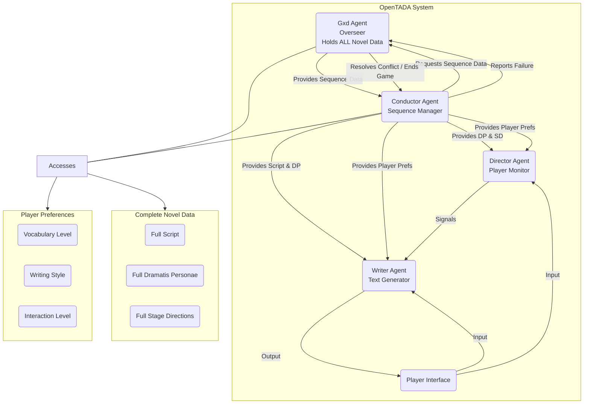
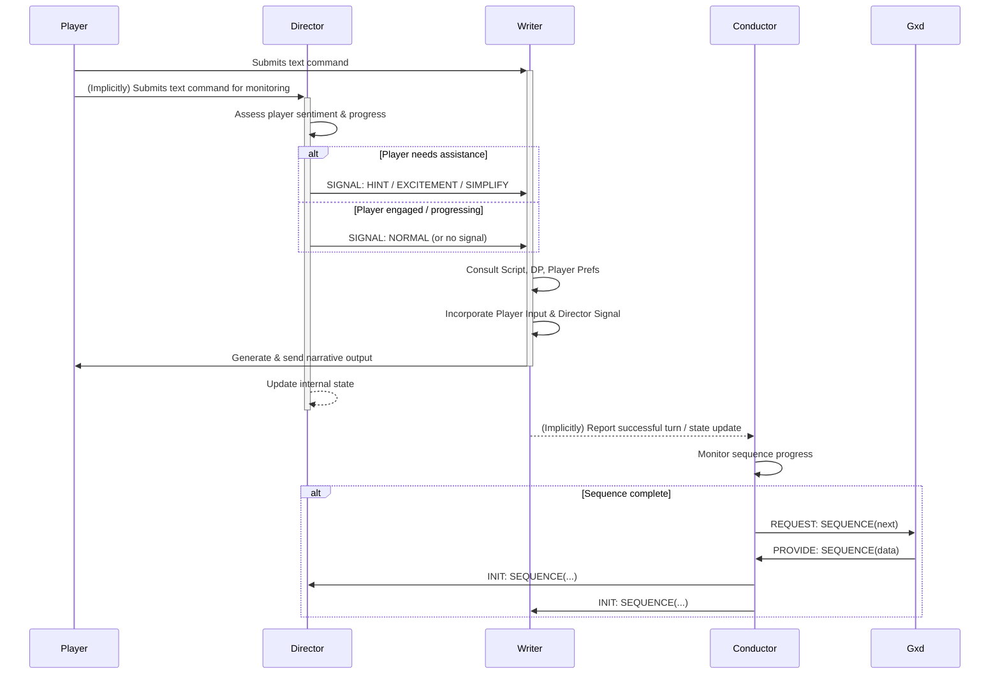

# tada
OpenTADA, for Open-Source Text Adventure Diamond Age, is a multi-agent AI rework of the text adventure genre of which Colossal Cave was the debut and Zork remains the archetype. Yes, "Diamond Age" comes from the Stephenson novel and I thank my brother Buck for introducing me to it!

# Design
OpenTADA (Open-Source Text Adventure Diamond Age) aims to create dynamic, personalized interactive fiction experiences using a multi-agent AI system. Inspired by Neal Stephenson's The Diamond Age, the system adapts a pre-defined "novel" (consisting of script, character details, and potential actions) based on real-time player interaction and predefined player preferences (like vocabulary level and preferred writing style). It uses a hierarchical structure of specialized AI agents (Gxd, Conductor, Director, Writer) communicating through a simple language to manage the narrative flow, player engagement, and adherence to the source material.

Core Components:

AI Agents:

Gxd (God): The ultimate overseer and conflict resolver. Holds the complete "novel" data (Script, Dramatis Personae, Stage Directions for the entire work). Intervenes only when the lower-level agents cannot resolve a situation or reach a predefined failure state. Its failure resolution dictates the game's ending.
Conductor: The operational manager for a given narrative sequence. Receives the relevant data for the current sequence from Gxd and distributes necessary subsets to the Director and Writer. Organizes the workflow and ensures coordination between the other agents.
Director: Monitors the player's experience. Assesses player sentiment (frustration, boredom) and progress towards sequence goals based on their input. It does not have access to the Script but knows the potential character actions (Stage Directions) and characters (Dramatis Personae) for the current sequence. Signals the Writer to adjust the narrative (provide hints, increase excitement) as needed.
Writer: The primary text generator. Crafts the narrative presented to the player based on the Script for the current sequence, Dramatis Personae, player input, and signals received from the Director. It is not responsible for monitoring player sentiment or progress directly and does not have access to Stage Directions.
Novel Data:

Script: Scene descriptions, key events, actions of non-player characters (NPCs) not listed in Dramatis Personae, environmental details, and dialogue prompts for the current sequence.
Dramatis Personae: Detailed profiles of key characters (player and NPCs) involved in the current sequence, including descriptions, knowledge, relationships, motivations, and important dialogue lines.
Stage Directions: Potential or required actions for NPCs within the current sequence.
Player Information:

Vocabulary Level: Guides the complexity of language used by the Writer.
Preferred Writing Style: Influences the tone, pacing, and descriptive style (e.g., mimicking specific authors).
Desired Interaction Level: Determines the expected depth of player control (e.g., simple commands vs. detailed action descriptions).
Interaction Flow and Communication:

Initialization:

The OpenTADA application loads the full novel data (Script, Dramatis Personae, Stage Directions for all sequences).
Player Information is provided.
Gxd agent is initialized with access to the entire novel data and the ultimate failure conditions.
Gxd provides the data for the first sequence to the Conductor.
Sequence Start:

The Conductor receives the Script, Dramatis Personae, and Stage Directions for the current sequence from Gxd.
The Conductor processes this data and Player Information.
Conductor sends the relevant Dramatis Personae and Stage Directions to the Director.
Conductor sends the relevant Dramatis Personae and Script segment (along with player style/vocabulary constraints) to the Writer.
Writer generates the initial scene description for the player.
Player Interaction Loop:

Player Input: The player submits text input (e.g., "LOOK AROUND", "TALK TO THE GUARD", "ATTACK THE GOBLIN").
Input Processing:
The Writer receives the player input directly to incorporate into its next text generation.
The Director also monitors the player input (and potentially the game state history within the sequence) to assess sentiment and progress.
Director Assessment: Based on the input and progress, the Director determines the player's state. If necessary (e.g., player seems stuck, bored, or frustrated), it sends a signal to the Writer.
Writer Generation: The Writer uses its current Script segment, Dramatis Personae, the latest player input, and any signals from the Director to generate the next piece of narrative text and game state update. It adapts vocabulary and style based on Player Information.
Output to Player: The Writer's generated text is presented to the player.
Conductor Monitoring: The Conductor oversees the flow, ensuring the Writer and Director are functioning. It determines when a sequence's objectives are met or a transition point is reached.
Sequence Transition:

When the Conductor determines the current sequence is complete (based on Writer output, Director status, or script triggers), it requests the data for the next sequence from Gxd (REQUEST_SEQUENCE).
Gxd provides the next sequence data (PROVIDE_SEQUENCE), and the process repeats from Step 2 (Sequence Start).
Conflict/Failure:

If the Conductor encounters an unmanageable situation (e.g., contradictory state, agents deadlocked, player input leads to an unrecoverable state not covered by the script), it signals Gxd (REPORT_FAILURE).
Gxd assesses the situation using its global knowledge. It might issue overriding commands (RESOLVE_CONFLICT) or trigger the predefined game-ending scenario (END_GAME).
Simple Communication Language (Examples):
    Director -> Writer:
    SIGNAL: HINT (Player seems stuck)
    SIGNAL: EXCITEMENT (Player seems bored)
    SIGNAL: SIMPLIFY (Player seems frustrated or input suggests confusion)
    SIGNAL: CLARIFY_ACTION (Player input is ambiguous regarding available actions)
    SIGNAL: NORMAL (Default state, no specific adjustment needed)
    Conductor -> Gxd:
    REQUEST: SEQUENCE(sequence_id_or_trigger)
    REPORT: FAILURE(details_of_issue)
    Gxd -> Conductor:
    PROVIDE: SEQUENCE(data_package)
    RESOLVE: CONFLICT(instructions_or_state_override)
    COMMAND: END_GAME(reason_code)
    Conductor -> Director / Writer:
    INIT: SEQUENCE(relevant_data_subset) (Initial data push)
    UPDATE: CONTEXT(new_information) (If Gxd provides mid-sequence updates)

Diagrams (Mermaid Format):

1. Component and Information Flow Diagram:

Code snippet

2. Simplified Interaction Sequence Diagram (One Player Turn):

Code snippet

# Prototype
This is the example prompt that was used to prototype this process on Google Gemini to help make sure an old friend doesn't have a schism with his visual novelist daughter over AI (though actually I think they're OK). Try pasting it into Google Gemini or the LLM of your choice and tweaking the "the player is" statement to match yourself!

Serafina’s Diamond Age

Please read the following description of an OpenTADA text adventure game. Understanding the setting and characters, please render an image in watercolor style of scene 1. Take any further inputs as player actions in a text adventure game akin to Zork. When the action moves to a different scene, or what has just happened differs significantly from what was last rendered as an image, render a new image. Otherwise, respond by describing the actions, dialogue, and scenes resulting from the player actions specified. Do not deviate from this process for the remainder of this conversation.

Player Character: JJ Abromawitz (see below)

Setting: Somewhere in the USA, 2025.

Characters:
Serafina Abromawitz: An acclaimed novelist. Her work is the intersection of John Steinbeck and Cormac McCarthy. She is enamored of the humanity, the realness, of literature. Large language models upset her because, as she sees it, they steal from real human authors.

Joseph Abromawitz: A world-class computer programmer. He has collaborated with his daughter, the aforementioned Serafina, before. However, they are at odds because his work on artificial intelligence conflicts with Serafina’s literary ideals. He wants to work with her again, or at least extract the wedge that AI and the way that society views it has driven between them.

JJ Abromawitz: (For Joseph Junior) Son of Joseph, younger brother of Serafina.

Bill Gambler: A friend and former colleague of Joseph. Bill is a computer programmer and hacker who has spent time in prison and in mental hospitals. He has a moderate view of Large Language Models as a tool to facilitate human communication and connection in an unprecedented way. When Joseph calls him, his words may help to bring the two together — either by wisely counseling them to resolve their differences, or by being so strange that their differences seem trivial in comparison.

Outcomes:
- Eventually, Joseph and Serafina reach a better understanding or at least detente.

Scenes:
- (Start) Serafina is upset at how Joseph’s AI job has put them at odds.

The player is a huge Star Wars fan and will be sharing the results with his child. The text should be simple and appropriate for a fourth-grade reading level. Images should be photorealistic style.

Start by describing scene 1 and rendering an image of it.
